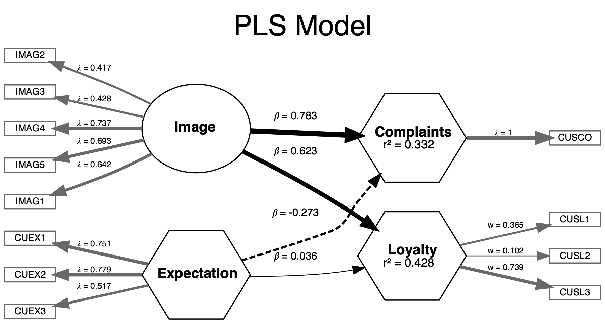
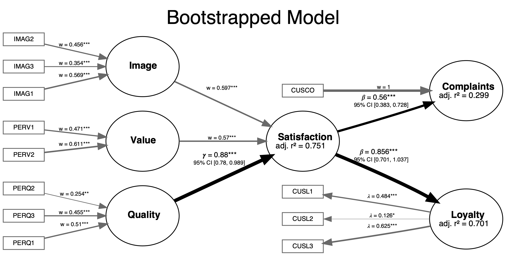
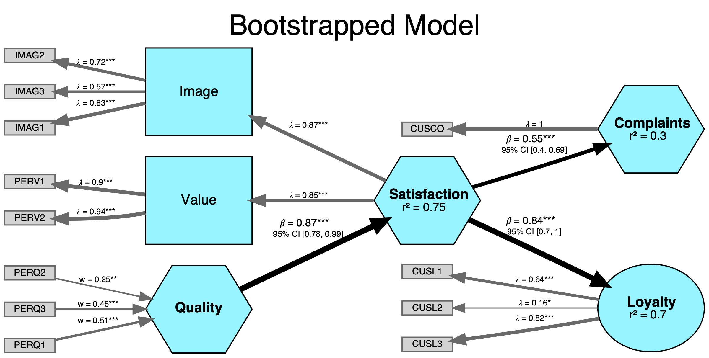

<!-- README.md is generated from README.Rmd. Please edit that file -->

```{r, echo = FALSE, warning=FALSE, message=FALSE}
library(seminr)
library(parallel)
knitr::opts_chunk$set(
  collapse = TRUE,
  comment = "#>",
  fig.path = "README-"
)
```

```{r echo=FALSE, out.width='25%'}
knitr::include_graphics('vignettes/SEMinR_logo.jpg')
```

<!--  -->
[](https://cran.r-project.org/package=seminr)
[](https://cran.r-project.org/package=seminr)

SEMinR allows users to easily create and modify structural equation models (SEM). 
It allows estimation using either covariance-based SEM (CBSEM, such as LISREL/Lavaan), 
or Partial Least Squares Path Modeling (PLS-PM, such as SmartPLS/semPLS).

- [First Look](#first-look)
- [Installation](#installation)
- [Usage and Examples](#usage-and-examples)
- [Documentation](#documentation)
- [Partner Projects](#partner-projects)
- [Contact Us](#contact-us)
- [About Us](#about-us)

## First Look

Main features of using SEMinR:

- A *natural* feeling, *domain-specific* language to build and estimate SEMs in R
- *High-level functions* to quickly specify interactions and complicated structural models
- *Modular design* of models that promotes reuse of model components
- Encourages *best practices* by use of smart defaults and warnings

Take a look at the easy syntax and modular design:

```{r echo=TRUE}
# Define measurements with famliar terms: reflective, multi-item constructs, etc.
measurements <- constructs(
  reflective("Image",       multi_items("IMAG", 1:5)),
  composite("Expectation", multi_items("CUEX", 1:3)),
  composite("Loyalty",     multi_items("CUSL", 1:3), weights = mode_B),
  composite("Complaints",  single_item("CUSCO"))
)

# Create four relationships (two regressions) in one line!
structure <- relationships(
  paths(from = c("Image", "Expectation"), to = c("Complaints", "Loyalty"))
)

# Put together reusable parts of your model to estimate CBSEM results
cbsem_model <- estimate_cbsem(data = mobi, measurements, structure)

# Re-estimate the model using another estimation technique (Consistent PLS)
pls_model <- estimate_pls(data = mobi, measurements, structure)
```

SEMinR can plot models using the semplot (for CBSEM models) or DiagrammeR (for PLS models) packages with a simple `plot` method.

```r
plot(pls_model, title = "PLS Model")
save_plot("myfigure.pdf")
```


```{r include = FALSE}
# Plot the PLS composite model
pl <- plot(pls_model, title = "PLS Model")
save_plot("man/figures/model_pls.png", width = 1800, plot = pl)
```



SEMinR allows various estimation methods for constructs and SEMs:

- Covariance-based Structural Equation Modeling (CBSEM)
  - *Covariance-based estimation* of SEM using the popular [Lavaan](https://github.com/yrosseel/lavaan) package
  - Currently supports mediation and moderation models with constructs
  - Easily *specify interactions* between constructs
  - Adds ten Berge *factor score extraction* to get same correlation patterns as latent factors
  - Adds *VIF* and other validity assessments
- Confirmatory Factor Analysis (CFA) using Lavaan
  - Uses [Lavaan](https://github.com/yrosseel/lavaan) package and returns results and syntax
  - Adds ten Berge *factor score extraction* to get same correlation patterns as latent factors
- Partial Least Squares Path Modeling (PLS-PM)
  - Uses non-parametric *variance-based estimation* to construct *composites* 
    and *common-factors*
  - Automatically *estimates using Consistent PLS (PLSc)* when 
    emulating reflective common factors
  - Adjusts for known biases in interaction terms in PLS models
  - Continuously tested against leading PLS-PM software to ensure parity
    of outcomes: SmartPLS, ADANCO, semPLS, and matrixpls
  - *High performance, multi-core* bootstrapping function

Researchers can now create a SEM and estimate it using different techniques (CBSEM, PLS-PM).

## Installation

You can install SEMinR from R with:

```{r, eval=FALSE}
install.packages("seminr")
```

## Usage and Examples

Load the SEMinR package:
```{r, eval=FALSE}
library(seminr)
```

Describe measurement and structural models and then estimate them. 
See the various examples below for different use cases:

1. [CFA + CBSEM Example with Common Factors](#cbsem--cfa-example-with-common-factors)
2. [Consistent-PLS (PLSc) Example with Common Factors](#consistent-pls-plsc-example-with-common-factors)
3. [PLS-PM Example with Composites](#pls-pm-example-with-composites)
4. [Comparing CBSEM and PLS-PM Example](#comparing-cbsem-and-pls-pm-example)

### CFA + CBSEM Example with Common Factors

Note that CBSEM models reflective common-factor constructs, not composites. 
SEMinR uses the powerful Lavaan package to estimate CBSEM models – you can even
inspect the more complicated Lavaan syntax that is produced.

Describe reflective constructs and interactions:

```{r, eval=FALSE}
# Distinguish and mix composite or reflective (common-factor) measurement models
# - composite measurements will have to be converted into reflective ones for CBSEM (see below)
measurements <- constructs(
  reflective("Image",       multi_items("IMAG", 1:5)),
  reflective("Expectation", multi_items("CUEX", 1:3)),
  interaction_term(iv = "Image", moderator = "Expectation", method = two_stage),
  reflective("Loyalty",     multi_items("CUSL", 1:3)),
  reflective("Complaints",  single_item("CUSCO"))
)
```

Describe the causal relationships between constructs and interactions:

```{r, eval=FALSE}
# Quickly create multiple paths "from" and "to" sets of constructs
structure <- relationships(
  paths(from = c("Image", "Expectation", "Image*Expectation"), to = "Loyalty"),
  paths(from = "Image", to = c("Complaints"))
)
```

Put the above elements together to estimate the model using Lavaan:

```{r, eval=FALSE}
# Evaluate only the measurement model using Confirmatory Factor Analysis (CFA)
cfa_model <- estimate_cfa(data = mobi, measurements)
summary(cfa_model)

# Dynamically compose full SEM models from individual parts
# - if measurement model includes composites, convert all constructs to reflective using:
#     as.reflective(measurements)
cbsem_model <- estimate_cbsem(data = mobi, measurements, structure)
sum_cbsem_model <- summary(cbsem_model)
sum_cbsem_model$meta$syntax # See the Lavaan syntax if you wish
```

### Consistent-PLS (PLSc) Example with Common Factors

Models with reflective common-factor constructs can also be estimated in PLS-PM, 
using Consistent-PLS (PLSc). Note that the popular SmartPLS software models constructs 
as composites rather than common-factors ([see below](#pls-pm-example-with-composites)) 
but can also do PLSc as a special option.

We will reuse the measurement and structural models from earlier:

```{r, eval=FALSE}
# Optionally inspect the measuremnt and structural models
measurements
structure
```

Estimate full model using Consistent-PLS and bootstrap it for confidence intervals:

```{r, eval=FALSE}
# Models with reflective constructs are automatically estimated using PLSc
pls_model <- estimate_pls(data = mobi, measurements, structure)
summary(pls_model)

# Use multi-core parallel processing to speed up bootstraps
boot_estimates <- bootstrap_model(pls_model, nboot = 1000, cores = 2)
summary(boot_estimates)
```

### PLS-PM Example with Composites

PLS-PM typically models composites (constructs that are weighted average of items) 
rather than common factors. Popular software like SmartPLS models composites 
either as Mode A (correlation weights) or Mode B (regression weights). 
We also support both modes as well as second-order composites.
rather than common factors. Popular software like SmartPLS models composites by default,
either as Mode A (correlation weights) or Mode B (regression weights). We also support
second-order composites.

Describe measurement model for each composite, interaction, or higher order composite:

```{r, eval=FALSE}
# Composites are Mode A (correlation) weighted by default
mobi_mm <- constructs(
  composite("Image",        multi_items("IMAG", 1:5)),
  composite("Value",        multi_items("PERV", 1:2)),
  higher_composite("Satisfaction", dimensions = c("Image","Value"), method = two_stage),
  composite("Expectation",  multi_items("CUEX", 1:3)),
  composite("Quality",      multi_items("PERQ", 1:7), weights = mode_B),
  composite("Complaints",   single_item("CUSCO")),
  composite("Loyalty",      multi_items("CUSL", 1:3), weights = mode_B)
)
```

Define a structural (inner) model for our PLS-PM:

```{r, eval=FALSE}
mobi_sm <- relationships(
  paths(from = c("Expectation","Quality"),  to = "Satisfaction"),
  paths(from = "Satisfaction", to = c("Complaints", "Loyalty"))
)
```

Estimate full model using PLS-PM and bootstrap it for confidence intervals:

```{r, eval=FALSE}
pls_model <- estimate_pls(
  data = mobi,
  measurement_model = mobi_mm,
  structural_model = mobi_sm
)

summary(pls_model)

# Use multi-core parallel processing to speed up bootstraps
boot_estimates <- bootstrap_model(pls_model, nboot = 1000, cores = 2)
summary(boot_estimates)
```

### Plotting the model results
SEMinR can plot all supported models using the dot language and the graphViz.js widget
from the `DiagrammeR` package. 

```{r}
# generate a small model for creating the plot
mobi_mm <- constructs(
  composite("Image",        multi_items("IMAG", 1:3)),
  composite("Value",        multi_items("PERV", 1:2)),
  higher_composite("Satisfaction", dimensions = c("Image","Value"), method = two_stage),
  composite("Quality",      multi_items("PERQ", 1:3), weights = mode_B),
  composite("Complaints",   single_item("CUSCO")),
  reflective("Loyalty",      multi_items("CUSL", 1:3))
)
mobi_sm <- relationships(
  paths(from = c("Quality"),  to = "Satisfaction"),
  paths(from = "Satisfaction", to = c("Complaints", "Loyalty"))
)
pls_model <- estimate_pls(
  data = mobi,
  measurement_model = mobi_mm,
  structural_model = mobi_sm
)
boot_estimates <- bootstrap_model(pls_model, nboot = 100, cores = 1)
```

When we have a model, we can plot it and save the plot to files.

```r
plot(boot_estimates, title = "Bootstrapped Model")
save_plot("myfigure.pdf")
```


```{r include = FALSE}
pl <- plot(boot_estimates, title = "Bootstrapped Model")
save_plot("man/figures/model.png", width = 2400, plot = pl)
```



#### Themes

We can customize the plot using an elaborate theme. Themes can be used for individual plots as a parameter or set as a default. Using the `seminr_theme_create()` function allows to define different themes.

```r
# Tip: auto complete is your friend in finding all possible themeing options.
thm <- seminr_theme_create(plot.rounding = 2, plot.adj = F, 
                           sm.node.fill = "cadetblue1",
                           mm.node.fill = "lightgray")
# change new default theme - valid until R is restarted
seminr_theme_set(thm)

# the new plot
plot(boot_estimates)
```


```{r include=FALSE}
# Tip: auto complete is your friend in finding all possible themeing options.
thm <- seminr_theme_create(plot.rounding = 2, plot.adj = F, 
                           sm.node.fill = "cadetblue1",
                           mm.node.fill = "lightgray")
# change new default theme - valid until R is restarted
seminr_theme_set(thm)


pl <- plot(boot_estimates, title = "Bootstrapped Model")
save_plot("man/figures/model2.png", width = 2400, plot = pl)
```



### Comparing CBSEM and PLS-PM Example

We can re-estimate a composite PLS-PM model as a common-factor CBSEM. 
Such a comparison might interest researchers seeking to evaluate how their constructs
behave when modeled as composites versus common-factors.

```{r, eval = FALSE}
# Define measurements with famliar terms: reflective, multi-item constructs, etc.
measurements <- constructs(
  composite("Image",       multi_items("IMAG", 1:5)),
  composite("Expectation", multi_items("CUEX", 1:3)),
  composite("Loyalty",     multi_items("CUSL", 1:3)),
  composite("Complaints",  single_item("CUSCO"))
)

# Create four relationships (two regressions) in one line!
structure <- relationships(
  paths(from = c("Image", "Expectation"), to = c("Complaints", "Loyalty"))
)

# First, estimate the model using PLS
pls_model <- estimate_pls(data = mobi, measurements, structure)

# Reusable parts of the model to estimate CBSEM results
# note: we are using the `as.reflective()` function to convert composites to common factors
cbsem_model <- estimate_cbsem(data = mobi, as.reflective(measurements), structure)

# Re-estimate the model using common factors in Consistent PLS (PLSc)
pls_model <- estimate_pls(data = mobi, as.reflective(measurements), structure)

```


## Documentation

The **vignette** for Seminr can be found on [CRAN](https://cran.r-project.org/package=seminr/vignettes/SEMinR.html) or by running the `vignette("SEMinR")` command after installation.

**Demo code** for various use cases with SEMinR can be found in the 
[seminr/demo/](https://github.com/sem-in-r/seminr/tree/master/demo) folder or by running commands such as `demo("seminr-contained")` after installation.

- [seminr-alternative-models.R](demo/seminr-alternative-models.R): Reuse measurement and structural components to easily create competing models
- [seminr-cbsem-cfa-ecsi.R](demo/seminr-cbsem-cfa-ecsi.R): Conduct confirmatory model building using CFA and CBSEM
- [seminr-pls-ecsi.R](demo/seminr-pls-ecsi.R): Conduct PLS path modeling
- [seminr-pls-higher_order.R](demo/seminr-pls-higher_order.R): Define higher-order composites for PLS models
- [seminr-pls-interaction.R](demo/seminr-pls-interaction.R): Define interactions between constructs in SEM models
- [seminr-plsc-ecsi.R](demo/seminr-plsc-ecsi.R): Run PLSc to emulate common factors using in PLSc
- [seminr-style-contained.R](demo/seminr-style-contained.R): Create and execute a SEM model in one function call
- [seminr-dot-graph.R](demo/seminr-pls-dot-graph.R): Create a plot from a SEM model

## Partner Projects

We communicate and collaborate with several other open-source projects on SEM related issues.

- [plspm package for R](https://github.com/gastonstat/plspm): an early and limited PLS path 
modeling package for R that inspired the development of SEMinR, among others; it is no longer maintained.
- [plspm package for Python](https://github.com/GoogleCloudPlatform/plspm-python): a well-maintained PLS modeling pakage for Python; it is tested against SEMinR and borrows some syntactic ideas from SEMinR.
- [cSEM](https://github.com/M-E-Rademaker/cSEM): an well-maintained and comprehensive 
composite analysis project implementing PLS and GSCA for R, using Lavaan style syntax

## Contact Us

**Facebook Group**: https://www.facebook.com/groups/seminr

You will find the developers and other users here who might also be able to help or discuss.

**Issue Tracker**: https://github.com/sem-in-r/seminr/issues

This is the official place to submit potential bugs or request new features for consideration.

## About Us

Primary Authors:

* [Soumya Ray](https://soumyaray.com)
* [Nicholas Danks](https://nicholasdanks.com)
* [André Calero Valdez](https://calerovaldez.com/)

Key Contributors:

* [James Uanhoro](http://jamesuanhoro.com/) (ten Berge factor extraction, advice on covariance-based methods)
* [Arturo Heynar Cano Bejar](https://www.iss.nthu.edu.tw/PhD/PhD-Students/arturo-h-cano-bejar) (evaluation and testing of PLS and CBSEM models)
* [Johannes Nakayama](https://github.com/JohannesNakayama) (contributions to the model visualization functionality)

And many thanks to the growing number of folks who have reached out with 
feature requests, bug reports, and encouragement. You keep us going!
