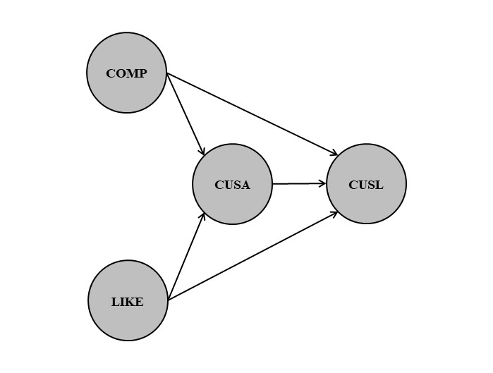
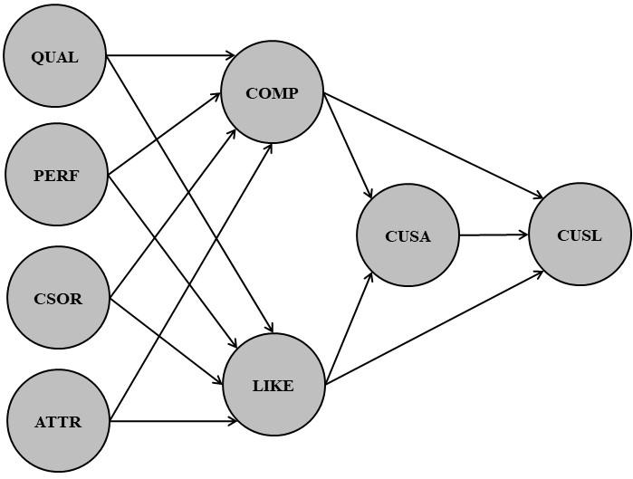

```{r, echo=FALSE, include=FALSE}
options(width = 120)

library(dplyr)
```

```{r klippy, echo=FALSE, include=TRUE}
klippy::klippy('')
```

# Introduction

This document accompanies the book *Partial Least Squares Structural Equation Modeling (PLS-SEM) Using R* by Joseph Hair, Tomas Hult, Christian M. Ringle, Marko Sarstedt, Nicholas Danks, and Soumya Ray.

It introduces a concise version of the book's R Code and outputs for the example corporate reputation model.

# Introduction to SEMinR (Chapter 3)

## Installing and loading the package

To download and install the SEMinR package call `install.packages("seminr")`.
(You only need to do this once to equip RStudio on your computer with SEMinR.)


To load the SEMinR library use `library(seminr)`.
(You must do this everytime you restart RStudio and wish to use SEMinR.)

```{r, class.source='klippy'}
library(seminr)
```

## Load and inspect the data

The data set accompanying the book ("Corporate Reputation Data.csv") is integrated in the SEMinR package.

```{r, class.source='klippy'}
corp_rep_data <- seminr::corp_rep_data

```
\

Alternatively, we can load the data by importing it from another file such as `"Corporate Reputation Data.csv"`.

```{r, class.source='klippy'}
corp_rep_data <- read.csv(file = "Corporate Reputation Data.csv", 
  header = TRUE, sep = ";")
```
\

Take a quick look at the data with `head()`.

```{r, results='hide', class.source='klippy'}
head(corp_rep_data)
```

```{r, echo = FALSE}
rmarkdown::paged_table(head(corp_rep_data))
```

## Model set up

### Model and measurement details

Here, we work with a simple corporate reputation model as displayed below in Fig. 1.
Tab. 1 shows the model's measurement details, i.e. the constructs, variable names and items.

```{r simpleModel, fig.align = 'center', out.width = "75%", fig.cap = "**Fig. 1** Simple corporate reputation model.", echo = F}

```

\

```{r, echo = FALSE}

constructs <- c(rep("Competence (COMP)", 3),
                rep("Likeability (LIKE)", 3),
                rep("Customer Satisfaction (CUSA)",1),
                rep("Customer Loyalty (CUSL)",3))

simpleModelMM <- cbind(constructs,
                       c("comp_1","comp_2","comp_3", "like_1","like_2","like_3","cusa","cusl_1","cusl_2","cusl_3"), 
                       c("[The company] is a top competitor in its market.",
                         "As far as I know, [the company] is recognized worldwide.",
                         "I believe that [the company] performs at a premium level.",
                         "[The company] is a company that I can better identify with than other companies.",
                         "[The company] is a company that I would regret more not having if it no longer existed than I would other companies.",
                         "I regard [the company] as a likeable company. ",
                         "I am satisfied with [the company].",
                         "I would recommend [company] to friends and relatives. ",
                         "If I had to choose again, I would choose [company] as my mobile phone services provider.",
                         "I will remain a customer of [company] in the future. "
))
colnames(simpleModelMM) <- c("construct", "variable name", "item")

knitr::kable(simpleModelMM,
             caption = "**Tab. 1** Measurement details for the simple corporate reputation model.")


```

### Create a measurement model

The `constructs()` function specifies the list of all construct measurement models. Within this list you can define various constructs: 

- 	`composite()` specifies the measurement of individual constructs. 
- 	`interaction_term()` specifies interactions terms.
- 	`higher_composite()` specifies hierarchical component models, i.e. higher-order constructs [@sarstedt2019specify].


Thereby, `composite()` specifies the measurement of individual constructs and 

- `multi_items()` creates a vector of multiple measurement items with similar names.
- `single_item()` describe a single measurement item.


For example, the composite *COMP* incorporates the items *comp_1* to *comp_3*.

```{r, class.source='klippy'}
corp_rep_mm <- constructs(
  composite("COMP", multi_items("comp_", 1:3)),
  composite("LIKE", multi_items("like_", 1:3)),
  composite("CUSA", single_item("cusa")),
  composite("CUSL", multi_items("cusl_", 1:3)))

```

### Create a structural model

The structural model indicates the sequence of the constructs and the relationships between them.

- `relationships()` specifies all the structural relationships between all constructs.
- `paths()` specifies relationships between a specific set of antecedents and outcomes.


For example, to specify the relationships from *COMP* and *LIKE* to *CUSA* and *CUSL*, we use the `from = ` and `to =` arguments in the `paths()` function: `paths(from = c("COMP", "LIKE"), to = c("CUSA", "CUSL"))`.


```{r, class.source='klippy'}
corp_rep_sm <- relationships(
  paths(from = c("COMP", "LIKE"), to = c("CUSA", "CUSL")),
  paths(from = c("CUSA"), to = c("CUSL")))
```

### Estimating the model

To estimate a PLS path model, algorithmic options and arguments settings must be selected. These can be reviewed by calling the function's documentation with `?estimate_pls`.


Here, we specify the data (`data = corp_rep_data`), the measurement model (`measurement_model = corp_rep_mm`) and structural model (`structural_model  = corp_rep_sm`) as well as the weighting scheme (`inner_weights = path_weighting`) and missing data handling with missing values being indicated by "-99" (`missing_value = "-99"`) and replaced by the mean (`missing = mean_replacement`).

```{r, class.source='klippy', collapse=T}
corp_rep_pls_model <- estimate_pls(data = corp_rep_data,
  measurement_model = corp_rep_mm,
  structural_model  = corp_rep_sm,
  inner_weights = path_weighting,
  missing = mean_replacement,
  missing_value = "-99")
```

### Summarizing the model

Once the model has been estimated, a summarized report of the results can be generated by using the `summary()` function.

```{r, class.source='klippy'}
summary_corp_rep <- summary(corp_rep_pls_model)
```
\

The `summary()` function applied to a SEMinR model object produces a `summary.seminr_model` class object. Its sub-objects (see Tab. 2) serve as basis for the assessment of the measurement and structural model [@Hair.2019].

```{r, echo = FALSE}
summary.seminr_model_subs <- cbind(c(
  "meta",
  "iterations",
  "paths",
  "total_effects",
  "total_indirect_effects",
  "loadings",
  "weights",
  "validity",
  "reliability",
  "composite_scores",
  "vif_antecedents",
  "fSquare",
  "descriptives",
  "it_criteria"), 
  c("The estimation function and version information.",
    "The number of iterations for the PLS algorithm to converge.",
    "The model’s path coefficients and (adjusted) R2 values.",
    "The model’s total effects.",
    "The model’s total indirect effects.",
    "The outer loadings for all constructs.",
    "The outer weights for all constructs.",
    "The metrics necessary to evaluate the construct measures’ validity.",
    "The metrics necessary to evaluate the construct measures’ reliability.",
    "The estimated scores for constructs.",
    "The metrics used to evaluate structural model collinearity.",
    "The f^2^ metric for all structural model relationships.",
    "The descriptive statistics of the indicator data.",
    "The Information Theoretic model selection criteria for the estimated model."))
colnames(summary.seminr_model_subs) <- c("Sub-object", "Content")

knitr::kable(summary.seminr_model_subs,
             caption = "**Tab. 2** Elements of the summary.seminr_model object.")
```
\

For example, by calling `summary_corp_rep$paths` we inspect the model’s path coefficients and the (adjusted) R^2^ values and by calling `summary_corp_rep$reliability`, we inspect the construct reliability metrics which we can plot with `plot(summary_corp_rep$reliability)`.

```{r, class.source='klippy'}
summary_corp_rep$paths

summary_corp_rep$reliability
plot(summary_corp_rep$reliability)
```
\

To check if and when the algorithm converged, we can inspect the number of iterations in `summary_corp_rep$iterations`.

```{r, class.source='klippy'}
summary_corp_rep$iterations
```
\

We can access summary statistics such as mean, standard deviation and number of missing values for the model's items and constructs by inspecting the `summary_corp_rep$descriptives$statistics` object.


Precisely, we call `summary_corp_rep$descriptives$statistics$items` to get the item statistics and `summary_corp_rep$descriptives$statistics$constructs` for the construct statistics. 

```{r, class.source='klippy'}
summary_corp_rep$descriptives$statistics$items

summary_corp_rep$descriptives$statistics$constructs
```

### Bootstrapping the model

In PLS-SEM, we need to perform bootstrapping to estimate standard errors and compute confidence intervals.

We run the bootstrapping with the `bootstrap_model()` function with 1,000 subsamples (`nboot = 1000`) and set a seed (`seed = 123`) to obtain reproducible results.

Next, we summarize the bootstrap model with `sum_boot_corp_rep <- summary(boot_corp_rep)` and obtain results on model estimates such as the path coefficients with `sum_boot_corp_rep$bootstrapped_paths`.

```{r, class.source='klippy', collapse=T}
boot_corp_rep <- bootstrap_model(seminr_model = corp_rep_pls_model,
  nboot = 1000,
  cores = NULL,
  seed = 123)

sum_boot_corp_rep <- summary(boot_corp_rep)

sum_boot_corp_rep$bootstrapped_paths
```
\

The `summary.boot_seminr_model` object, i.e. `sum_boot_corp_rep`, contains the following sub-objects (Tab. 3):

```{r, echo = FALSE}
summary.boot_seminr_model_subs <- cbind(c(
  "nboot", "bootstrapped_paths", 
  "bootstrapped_weights", "bootstrapped_loadings", 
  "bootstrapped_HTMT", "bootstrapped_total_paths" 
),
c(
  "The number of bootstrap subsamples generated during bootstrapping. ",
  "The bootstrap estimated standard error, T statistic, and confidence intervals for the path coefficients. ",
  "The bootstrap estimated standard error, T statistic, and confidence intervals for the indicator weights.",
  "The bootstrap estimated standard error, T statistic, and confidence intervals for the indicator loadings.",
  "The bootstrap estimated standard error, T statistic, and confidence intervals for the HTMT values.",
  "The bootstrap estimated standard error, T statistic, and confidence intervals for the model’s total effects."))

colnames(summary.boot_seminr_model_subs) <- c("Sub-object", "Content")

knitr::kable(summary.boot_seminr_model_subs,
             caption = "**Tab. 3** Elements of the summary.boot_seminr_model object.")
```

# Evaluation of reflective measurement models (Chapter 4)

## Indicator reliability

For the reflective measurement model, we need to estimate the relationships between the reflectively measured constructs and their indicators (i.e., loadings). Indicator reliability can be calculated by squaring the loadings.


Low indicator reliability may result in biased construct results. Therefore, we evaluate indicator loadings as follows:

- Indicator loadings above 0.708 are recommended, since they correspond to an explained variance (indicator reliabilty) of at least 50%.
- Indicators with loadings between 0.40 and 0.70 should be considered for removal.
- Indicators with very low loadings (below 0.40) should be removed.


We can get the loadings by inspecting the `summary.seminr_model` object's loadings element (`summary_corp_rep$loadings`).

```{r, class.source='klippy'}
summary_corp_rep$loadings
```
\

We can get the indicator reliability by squaring the loadings.

```{r, class.source='klippy'}
summary_corp_rep$loadings^2
```

## Internal consistency reliability

Internal consistency reliability is the extent to which indicators measuring the same construct are associated with each other.

Of the various indicators for internal consistency reliability, Cronbach’s alpha is the lower bound [@trizano2016best], the composite reliability $\rho$c [@joreskog1971simultaneous1971] is the upper bound for internal consistency reliability. The exact (or consistent) reliability coefficient $\rho$A usually lies between these bounds and may serve as a good representation of a construct’s internal consistency reliability [@dijkstra2010latent; @dijkstra2014pls; @dijkstra2015consistent].

An item is acceptable for inclusion in the model if its internal consistency reliability takes specific values:

-	Recommended value of 0.80 to 0.90.
- Minimum value of 0.70 (or 0.60 in exploratory research).
-	Maximum value of 0.95 to avoid indicator redundancy, which would compromise content validity [@diamantopoulos2012guidelines].

The reliability indicators can be found in `summary_corp_rep$reliability` and plotted with `plot(summary_corp_rep$reliability)`.

```{r, class.source='klippy'}
summary_corp_rep$reliability
plot(summary_corp_rep$reliability)
```

## Convergent validity

Convergent validity is the extent to which the construct converges in order to explain the variance of its indicators. The average variance extracted (AVE) is the mean of a construct indicator's squared loadings.
The minimum acceptable AVE is 0.50 or higher [@Hair.2021].

AVE values can also be accessed at `summary_corp_rep$reliability`.

```{r, class.source='klippy'}
summary_corp_rep$reliability
```

## Discriminant validty

According to the older Fornell-Larcker criterion [@fornell1981evaluating], the square root of the AVE of each construct should be higher than the construct’s highest correlation with any other construct in the model. These results can be outputted by `summary_corp_rep$validity$fl_criteria`.

However, this metric is not suitable for discriminant validity assessment due to its poor performance in detecting discriminant validity problems [@henseler2015new; @radomir2019discriminant].

```{r, class.source='klippy'}
summary_corp_rep$validity$fl_criteria
```
\

We recommend the heterotrait-monotrait ratio (HTMT) of the correlations to assess discriminant validity [@henseler2015new].

The HTMT is the mean value of the indicator correlations across constructs (i.e., the heterotrait-heteromethod correlations) relative to the (geometric) mean of the average correlations for the indicators measuring the same construct (i.e., the monotrait-heteromethod correlations).

Discriminant validity problems are present when HTMT values 

- exceed 0.90 for constructs that are conceptually very similar.
- exceed 0.85 for constructs that are conceptually more distinct.

We can get the HTMT matrix by calling `summary_corp_rep$validity$htmt`.

```{r, class.source='klippy'}
summary_corp_rep$validity$htmt
```
\

We can use bootstrap confidence intervals to test if the HTMT is significantly different from 1.00 [@henseler2015new] or a lower threshold value such as 0.90 or 0.85, which should be defined based on the study context [@franke2019heuristics].

We obtain the HTMT 90% bootstrap CI by calling `sum_boot_corp_rep <- summary(boot_corp_rep, alpha = 0.10)` and inspect the object `sum_boot_corp_rep$bootstrapped_HTMT`.

```{r, class.source='klippy'}
sum_boot_corp_rep <- summary(boot_corp_rep, alpha = 0.10)

sum_boot_corp_rep$bootstrapped_HTMT
```
# Evaluation of formative measurement models (Chapter 5)

Relevant criteria for evaluating formative measurement models include the assessment of:

(1) Convergent validity.
(2) Indicator collinearity. 
(3) Statistical significance and relevance of the indicator weights.

## Model set up

### Model and measurement details

Here, we work with an extended corporate reputation model as displayed below in Fig. 2.

Tab. 4 shows the model's measurement details, i.e. the constructs, variable names and items for the formative constructs:

- *QUAL*: The quality of a company’s products and services as well as its quality of customer orientation.
- *PERF*: The company’s economic and managerial performance.
- *CSOR*: The company’s corporate social responsibility.
- *ATTR*: The company’s attractiveness.

```{r extendedModel, fig.align = 'center', out.width = "75%", fig.cap = "**Fig. 2** Extended corporate reputation model.", echo = F}

```

\

```{r, echo = FALSE}

constructs_ext <- c(rep("Quality (QUAL)", 8),
                rep("Performance (PERF)", 5),
                rep("Corporate Social Responsibility (CSOR)", 5),
                rep("Attractiveness (ATTR)",3),
                rep("Single-item measure for the redundancy analysis", 4))

ext_ModelMM <- cbind(constructs_ext,
                     c("qual_1","qual_2","qual_3","qual_4","qual_5","qual_6","qual_7","qual_8","perf_1","perf_2","perf_3","perf_4","perf_5","csor_1","csor_2","csor_3","csor_4","csor_5","attr_1","attr_2","attr_3","qual_global","perf_global","csor_global","attr_global"), 
                     c("The products/services offered by [the company] are of high quality.",
                       "[The company] is an innovator, rather than an imitator with respect to [industry].",
                       "[The company]’s products/services offer good value for money.",
                       "The services [the company] offered are good.",
                       "Customer concerns are held in high regard at [the company].",
                       "[The company] is a reliable partner for customers.",
                       "[The company] is a trustworthy company.",
                       "I have a lot of respect for [the company].",
                       "[The company] is a very well-managed company.",
                       "[The company] is an economically stable company.",
                       "The business risk for [the company] is modest compared to its competitors.",
                       "[The company] has growth potential.",
                       "[The company] has a clear vision about the future of the company.",
                       "[The company] behaves in a socially conscious way.",
                       "[The company] is forthright in giving information to the public.",
                       "[The company] has a fair attitude toward competitors.",
                       "[The company] is concerned about the preservation of the environment.",
                       "[The company] is not only concerned about profits.",
                       "[The company] is successful in attracting high-quality employees.",
                       "I could see myself working at [the company].",
                       "I like the physical appearance of [the company] (company, buildings, shops, etc.).",
                       "Please assess the overall quality of [the company’s] activities.",
                       "Please assess [the company’s] overall performance.",
                       "Please assess the extent to which [the company] acts in socially conscious ways.",
                       "Please assess [the company’s] overall attractiveness."
                     ))
colnames(ext_ModelMM) <- c("construct", "variable name", "item")

knitr::kable(ext_ModelMM,
             caption = "**Tab. 4** Measurement details for the extended corporate reputation model.")


```

### Estimating and bootstrapping the model

According to the extended model, we update the measurement and structural model specifications.
Note that the four drivers *QUAL*, *PERF*, *CSOR*, and *ATTR* are formative constructs, estimated with `mode_B`, while *COMP* and *LIKE* are reflective, estimated with `mode_A` (default setting in the `composite()` function).

```{r, class.source='klippy'}
corp_rep_mm_ext <- constructs(
  composite("QUAL", multi_items("qual_", 1:8), weights = mode_B),
  composite("PERF", multi_items("perf_", 1:5), weights = mode_B),
  composite("CSOR", multi_items("csor_", 1:5), weights = mode_B),
  composite("ATTR", multi_items("attr_", 1:3), weights = mode_B),
  composite("COMP", multi_items("comp_", 1:3)),
  composite("LIKE", multi_items("like_", 1:3)),
  composite("CUSA", single_item("cusa")),
  composite("CUSL", multi_items("cusl_", 1:3)))

corp_rep_sm_ext <- relationships(
  paths(from = c("QUAL", "PERF", "CSOR", "ATTR"), to = c("COMP", "LIKE")),
  paths(from = c("COMP", "LIKE"), to = c("CUSA", "CUSL")),
  paths(from = c("CUSA"), to = c("CUSL"))
)
```
\

Once the model is set up, we estimate the model with `estimate_pls()` and store it in `corp_rep_pls_model_ext` to summarize it with `summary(corp_rep_pls_model_ext)`.

Further, we bootstrap the model (`bootstrap_model()`), summarize the result with a 90% CI by calling `summary(boot_corp_rep_ext, alpha = 0.10)` and store the result in `summary_boot_corp_rep_ext`.

```{r, class.source='klippy', collapse=T}
corp_rep_pls_model_ext <- estimate_pls(
  data = corp_rep_data,
  measurement_model = corp_rep_mm_ext,
  structural_model = corp_rep_sm_ext,
  missing = mean_replacement,
  missing_value = "-99")

summary_corp_rep_ext <- summary(corp_rep_pls_model_ext)

boot_corp_rep_ext <- bootstrap_model(seminr_model = corp_rep_pls_model_ext,
                                     nboot = 1000,
                                     seed = 123)

summary_boot_corp_rep_ext <- summary(boot_corp_rep_ext, alpha = 0.10)
```

### Reflective Measurement Model Evaluation

PLS-SEM model estimates will change when any of the model relationships or variables are changed. We thus need to reassess the reflective measurement models to ensure that this portion of the model remains valid and reliable.

\

#### Indicator reliability

```{r, class.source='klippy'}
summary_corp_rep_ext$loadings

summary_corp_rep_ext$loadings^2
```
\

#### Internal consistence reliability and convergent validity

```{r, class.source='klippy'}
summary_corp_rep_ext$reliability
```
\

#### Discriminant validity

\

**Fornell-Larcker criterion [@fornell1981evaluating]**

```{r, class.source='klippy'}
summary_corp_rep_ext$validity$fl_criteria
```
\

**Heterotrait-monotrait ratio (HTMT) of the correlations [@henseler2015new]**

```{r, class.source='klippy'}
summary_corp_rep_ext$validity$htmt

summary_boot_corp_rep_ext$bootstrapped_HTMT
```

## Convergent validity

To examine the formatively measured constructs' convergent validity, we carry out a separate redundancy analysis for each construct (see Fig 3.). The survey contained global single-item measures with generic assessments of the four phenomena—attractiveness, corporate social responsibility, performance, and quality—that we can use as measures of the dependent construct in the redundancy analyses (*attr_global*, *csor_global*, *perf_global*, and *qual_global*).

```{r redundancyAanalysisDiagrams, fig.align = 'center', out.width = "100%", fig.cap = "**Fig. 3** Redundancy analysis of formatively measured constructs.", echo = F}
knitr::include_graphics("redundancyAanalysisDiagrams.JPG")
```

To run the redundancy analysis for a formatively measured construct (e.g. attractiveness), we link it with an alternative measure of the same concept (*attr_global*). Here, the measurement model consists of two constructs (the multi-item formative measure and the global item) and the structural model consists of a single path. To perform the redundancy analysis, we first estimate each model with `estimate_pls()` and summarize it.

Subsequently, we check the path coefficients for convergent validity. A path coefficient of 0.70 (R^2^ = 50%) provides support for the formatively measured construct’s convergent validity.

**Attractiveness (ATTR)**

```{r, class.source='klippy', collapse=T}
# Create measurement model
ATTR_redundancy_mm <- constructs(
  composite("ATTR_F", multi_items("attr_", 1:3), weights = mode_B),
  composite("ATTR_G", single_item("attr_global"))
)

# Create structural model
ATTR_redundancy_sm <- relationships(
  paths(from = c("ATTR_F"), to = c("ATTR_G"))
)

# Estimate the model
ATTR_redundancy_pls_model <- estimate_pls(
  data = corp_rep_data,
  measurement_model = ATTR_redundancy_mm,
  structural_model = ATTR_redundancy_sm,
  missing = mean_replacement,
  missing_value = "-99")

# Summarize the model
sum_ATTR_red_model <- summary(ATTR_redundancy_pls_model)
```

```{r, class.source='klippy'}
sum_ATTR_red_model$paths
```
\

**Corporate Social Responsibility (CSOR)**

```{r, class.source='klippy', collapse=T}
# Create measurement model
CSOR_redundancy_mm <- constructs(
  composite("CSOR_F", multi_items("csor_", 1:5), weights = mode_B),
  composite("CSOR_G", single_item("csor_global"))
)

# Create structural model
CSOR_redundancy_sm <- relationships(
  paths(from = c("CSOR_F"), to = c("CSOR_G"))
)

# Estimate the model
CSOR_redundancy_pls_model <- estimate_pls(
  data = corp_rep_data,
  measurement_model = CSOR_redundancy_mm,
  structural_model = CSOR_redundancy_sm,
  missing = mean_replacement,
  missing_value = "-99")

# Summarize the model
sum_CSOR_red_model <- summary(CSOR_redundancy_pls_model)
```

```{r, class.source='klippy'}
sum_CSOR_red_model$paths
```
\

**Performance (PERF)**

```{r, class.source='klippy', collapse=T}
# Create measurement model
PERF_redundancy_mm <- constructs(
  composite("PERF_F", multi_items("perf_", 1:5), weights = mode_B),
  composite("PERF_G", single_item("perf_global"))
)

# Create structural model
PERF_redundancy_sm <- relationships(
  paths(from = c("PERF_F"), to = c("PERF_G"))
)

# Estimate the model
PERF_redundancy_pls_model <- estimate_pls(
  data = corp_rep_data,
  measurement_model = PERF_redundancy_mm,
  structural_model  = PERF_redundancy_sm,
  missing = mean_replacement,
  missing_value = "-99")

# Summarize the model
sum_PERF_red_model <- summary(PERF_redundancy_pls_model)
```

```{r, class.source='klippy'}
sum_PERF_red_model$paths
```

\

**Quality (QUAL)**

```{r, class.source='klippy', collapse=T}
# Create measurement model
QUAL_redundancy_mm <- constructs(
  composite("QUAL_F", multi_items("qual_", 1:8), weights = mode_B),
  composite("QUAL_G", single_item("qual_global"))
)

# Create structural model
QUAL_redundancy_sm <- relationships(
  paths(from = c("QUAL_F"), to = c("QUAL_G"))
)

# Estimate the model
QUAL_redundancy_pls_model <- estimate_pls(
  data = corp_rep_data,
  measurement_model = QUAL_redundancy_mm,
  structural_model  = QUAL_redundancy_sm,
  missing = mean_replacement,
  missing_value = "-99")

# Summarize the model
sum_QUAL_red_model <- summary(QUAL_redundancy_pls_model)
```

```{r, class.source='klippy'}
sum_QUAL_red_model$paths
```

## Indicator collinearity

To check the formative measurement models for collinearity, we inspect the model summary object `summary_corp_rep_ext` for the indicator variance inflation factor (VIF) values by calling `summary_corp_rep_ext$validity$vif_items`.

VIF values of 5 or above are indicative of collinearity issues. However, collinearity issues may also be evidenced by VIF values of 3 [@mason1991collinearity; @becker2015collinearity].

```{r, class.source='klippy'}
summary_corp_rep_ext$validity$vif_items
```

## Significance and relevance of the indicator weights

We consider the significance of the indicator weights by means of bootstrapping (`bootstrap_model()`). We assign the output to the `boot_corp_rep_ext` object and apply `summary()` with a significance level of 5% (`alpha = 0.05`) for two-tailed testing.

```{r, class.source='klippy', collapse=T}
boot_corp_rep_ext <- bootstrap_model(
  seminr_model = corp_rep_pls_model_ext,
  nboot = 1000,
  cores = parallel::detectCores(), 
  seed = 123)

summary_boot_corp_rep_ext <- summary(boot_corp_rep_ext, alpha = 0.05)
```
\

To inspect the indicator weight's significance in the formative measurement model we inspect the `summary_boot_corp_rep_ext$bootstrapped_weights` object.

```{r, class.source='klippy'}
summary_boot_corp_rep_ext$bootstrapped_weights
```
\

To inspect the indicator's relevance in the formative measurement model we inspect the `summary_boot_corp_rep_ext$bootstrapped_loadings` object.

```{r, class.source='klippy'}
summary_boot_corp_rep_ext$bootstrapped_loadings
```
\

Indicators with significant weights can be retained. If an indicator's weight is not significant, the indicator should be considered for removal from the measurement model. However, the indicator can also be retained if, at a minimum, a formative indicator’s loading is significant or if the loading is at least 0.5 as this suggests that the indicator makes a sufficient absolute contribution to forming the construct.

# Evaluation of the structural model (Chapter 6)

## Collinearity issues

To examine the VIF values for the predictor constructs we inspect the `vif_antecedents` element within the `summary_corp_rep_ext` object. The VIF values above 5 (respectively 3) may indicate collinearity issues.

```{r, class.source='klippy'}
summary_corp_rep_ext$vif_antecedents
```

## Significance and relevance of the structural model relationships

To evaluate the relevance and significance of the structural paths, we inspect the `bootstrapped_paths` element nested in the `sum_boot_corp_ext` object. 

```{r, class.source='klippy'}
summary_boot_corp_rep_ext$bootstrapped_paths
```
\

The total effects help to assess the impact of the four exogenous driver constructs (*ATTR*, *CSOR*, *PERF*, and *QUAL*) on the outcome constructs *CUSA* and *CUSL.* They are stored in the `bootstrapped_total_paths` element of `summary_boot_corp_rep_ext`.

```{r, class.source='klippy'}
summary_boot_corp_rep_ext$bootstrapped_total_paths
```

## Explanatory power

To consider the model's explanatory power we analyze the R^2^ of the endogenous constructs and the f^2^ effect size of the predictor constructs.

R^2^ and adjusted R^2^ can be obtained from the `summary_corp_rep_ext$paths` element.

```{r, class.source='klippy'}
summary_corp_rep_ext$paths
```
\

The f^2^ effect size is stored in `summary_corp_rep_ext$fSquare`.

```{r, class.source='klippy'}
summary_corp_rep_ext$fSquare
```

## Predictive power 

### Generate predictions

To evaluate the model’s predictive power, we generate the predictions using the `predict_pls()` function.

We run the PLSpredict procedure with k=10 folds (`noFolds = 10`) and 10 repetitions (`reps = 10`). In addition, we use the direct antecedents approach (`technique = predict_DA`) to consider both the antecedent and the mediator as predictors of the outcome. 
Initial simulation evidence suggests a higher accuracy for the DA approach as opposed to the competing earliest antecedents approach (EA approach) which excludes the mediator(s) from the analysis [@Ray2017].

Finally, we summarize the PLSpredict model and assign the output to the `sum_predict_corp_rep_ext` object.

```{r, class.source='klippy'}
predict_corp_rep_ext <- predict_pls(
  model = corp_rep_pls_model_ext,
  technique = predict_DA,
  noFolds = 10,
  reps = 10)

sum_predict_corp_rep_ext <- summary(predict_corp_rep_ext)
```

### Inspect prediction errors

Two popular prediction statistics that quantify the amount of prediction error are the mean absolute error (MAE) and the root mean squared error (RMSE).

If the prediction error is highly skewed, the MAE is a more appropriate metric than the RMSE. To assess the distribution of prediction error, we use the `plot()` function on the object `sum_predict_corp_rep_ext` and specify the `indicator` argument to the indicators of interest, e.g. *cusl_1*, *cusl_2*, and *cusl_3.*

Note that by calling `par(mfrow=c(1,3))` we arrange the three output plots horizontally and undo that plot setting with `par(mfrow=c(1,1))`.

```{r predErrorFigure, class.source='klippy', fig.show='hide', fig.width = 10, fig.height = 5, collapse=T}
par(mfrow=c(1,3))
plot(sum_predict_corp_rep_ext,
  indicator = "cusl_1")
plot(sum_predict_corp_rep_ext,
  indicator = "cusl_2")
plot(sum_predict_corp_rep_ext,
  indicator = "cusl_3")
par(mfrow=c(1,1))

```

`)

We get the prediction errors by inspecting `sum_predict_corp_rep_ext`.

The prediction statistics' raw values do not carry much meaning. Hence, researchers need to compare the RMSE (or MAE) values with a naïve linear regression model (LM) benchmark [@danks2018predictions].

In comparing the RMSE (or MAE) values with the LM values, the following guidelines apply [@shmueli2019predictive]:

- High predictive power: *All* indicators in the PLS-SEM analysis have lower RMSE (or MAE) values compared to the LM.
- Medium predictive power: The *majority* (or the same number) of the indicators in the PLS-SEM analysis have lower RMSE (or MAE) values compared to the LM.
- Low predictive power: The *minority* of the of the indicators in the PLS-SEM analysis have lower RMSE (or MAE) values compared to the LM.
- Lack of predictive power: *None* of the of the indicators in the PLS-SEM analysis have lower RMSE (or MAE) values compared to the LM.

```{r, class.source='klippy'}
sum_predict_corp_rep_ext
```

## Predictive model comparisons

To perform model comparison, we set up three theoretically justifiable competing models (Model 1, Model 2, and Model 3 in Fig. 4).

```{r alternativeModels, fig.align = 'center', out.width = "100%", fig.cap = "**Fig. 4** Alternative Models.", echo = F}
knitr::include_graphics("alternativeModels.JPG")
```

The models share a measurement model and so we need only specify the measurement model one time. However, each model has a unique structural model and thus we specify three structural models and assign the output to `structural_model1`, `structural_model2`, and `structural_model3.` We then estimate three separate PLS models and summarize the results to `sum_model1`, `sum_model2`, and `sum_model3`.

```{r, class.source='klippy', collapse=T}
# Create measurement model
measurement_model <- constructs(
  composite("QUAL", multi_items("qual_", 1:8), weights = mode_B),
  composite("PERF", multi_items("perf_", 1:5), weights = mode_B),
  composite("CSOR", multi_items("csor_", 1:5), weights = mode_B),
  composite("ATTR", multi_items("attr_", 1:3), weights = mode_B),
  composite("COMP", multi_items("comp_", 1:3)),
  composite("LIKE", multi_items("like_", 1:3)),
  composite("CUSA", single_item("cusa")),
  composite("CUSL", multi_items("cusl_", 1:3))
)

# Create structural models
# Model 1
structural_model1 <- relationships(
  paths(from = c("QUAL","PERF","CSOR","ATTR"), to = c("COMP", "LIKE")),
  paths(from = c("COMP","LIKE"),  to = c("CUSA", "CUSL")),
  paths(from = "CUSA", to = c("CUSL"))
)
# Model 2
structural_model2 <- relationships(
  paths(from = c("QUAL","PERF","CSOR","ATTR"), to = c("COMP", "LIKE", "CUSA")),
  paths(from = c("COMP","LIKE"),  to = c("CUSA", "CUSL")),
  paths(from = "CUSA", to = c("CUSL"))
)
# Model 3
structural_model3 <- relationships(
  paths(from = c("QUAL","PERF","CSOR","ATTR"), 
        to = c("COMP", "LIKE", "CUSA", "CUSL")),
  paths(from = c("COMP","LIKE"),  to = c("CUSA", "CUSL")),
  paths(from = "CUSA", to = c("CUSL"))
)

# Estimate and summarize the models
pls_model1 <- estimate_pls(
  data  = corp_rep_data,
  measurement_model = measurement_model,
  structural_model  = structural_model1,
  missing_value = "-99"
)
sum_model1 <- summary(pls_model1)

pls_model2 <- estimate_pls(
  data  = corp_rep_data,
  measurement_model = measurement_model,
  structural_model  = structural_model2,
  missing_value = "-99"
)
sum_model2 <- summary(pls_model2)

pls_model3 <- estimate_pls(
  data  = corp_rep_data,
  measurement_model = measurement_model,
  structural_model  = structural_model3,
  missing_value = "-99"
)
sum_model3 <- summary(pls_model3)
```
\

The matrix of the model’s information criteria includes the AIC and BIC value for each outcome construct and can be accessed by inspecting the `it_criteria` element in the summary objects (e.g. `sum_model1$it_criteria`).

```{r, class.source='klippy'}
sum_model1$it_criteria
sum_model2$it_criteria
sum_model3$it_criteria
```
\

To compare BICs for *CUSA*, we extract and compare Schwarz's [-@schwarz1978estimating] Bayesian information criterion (BIC), we subset this matrix to return only the BIC row of the *CUSA* column (e.g. `sum_model1$it_criteria["BIC", "CUSA"]`).

To compare the BIC for the three models we assign each model's BIC for *CUSΑ* to the vector `itcriteria_vector` and name the vector using the `names()` function. The model that produces the lowest value in BIC is to be selected.

```{r, class.source='klippy'}
itcriteria_vector <- c(sum_model1$it_criteria["BIC", "CUSA"],
                       sum_model2$it_criteria["BIC", "CUSA"],
                       sum_model3$it_criteria["BIC", "CUSA"])

names(itcriteria_vector) <- c("Model1", "Model2", "Model3")

itcriteria_vector
```
\

Finally we inspect that `itcriteria_vector` and calculate the BIC Akaike Weights using the `compute_it_criteria_weights()` function.

Akaike weights indicate a model’s relative likelihood and faciliate model comparisons in light of model selection uncertainty that may arise when BIC differences are small [@danks2020model].

The higher the Akaike weights, the more likely that the model selected better represents the data generation model. We comoute the Akaike weights by inserting `itcriteria_vector` in the `compute_itcriteria_weights()` function.

```{r, class.source='klippy'}
compute_itcriteria_weights(itcriteria_vector)
```

# Mediation analysis (Chapter 7)

Mediation occurs when a construct, referred to as mediator construct, intervenes between two other related constructs (see Fig. 5 for a generic mediation model). 
Direct effects are the relationships linking two constructs with a single arrow (p~1~, p~2~, and p~3~). Indirect effects represent a sequence of relationships with at least one intervening construct. Thus, an indirect effect is a sequence of two or more direct effects (p~1~ and p~2~) and is represented visually by multiple arrows. Fig. 6 shows two mediation effects in the corporate reputation model, i.e. from *COMP* through *CUSA* to *CUSL* and from *LIKE* through *CUSA* to *CUSL*.

```{r genericMediationModel, fig.align = 'center', out.width = "40%", fig.cap = "**Fig. 5** Generic mediation model.", echo = F}
knitr::include_graphics("genericMediationModel.JPG")
```
\

```{r mediationModel, fig.align = 'center', out.width = "75%", fig.cap = "**Fig. 6** Corporate reputation model with highlighted mediation paths (dotted lines).", echo = F}
knitr::include_graphics("mediationModel.JPG")
```
\

The results for the indirect effects ($\small p~1~*p~2~$) can be found by inspecting the `total_indirect_effects` element within the `summary_corp_rep_ext` object.

```{r, class.source='klippy'}
summary_corp_rep_ext$total_indirect_effects
```
\

Specific indirect paths can be evaluated for significance by using the `specific_effect_significance()` function.
This function takes a bootstrapped model object (`boot_seminr_model = boot_corp_rep_ext`), an antecedent construct name (`from = "COMP`, respectively `from = "LIKE`), a mediator construct name (`through = "CUSA"`) and an outcome construct name (`to = "CUSL"`) as arguments and returns the confidence interval (e.g. with `alpha = 0.05`) for the total indirect paths from the antecedent to the outcome construct.

Note that for serial mediation models, the `through` argument can take multiple mediating constructs as arguments (e.g. `through = c("construct1", "construct2”)`). 

For example, the specific indirect effects for the paths from *COMP* through *CUSA* to *CUSL* and *LIKE* through *CUSA* to *CUSL* are:

```{r, class.source='klippy'}
specific_effect_significance(boot_seminr_model = boot_corp_rep_ext, 
  from = "COMP", 
  through = "CUSA", 
  to = "CUSL", 
  alpha = 0.05)

specific_effect_significance(boot_corp_rep_ext, 
  from = "LIKE", 
  through = "CUSA", 
  to = "CUSL", 
  alpha = 0.05)
```
\

We consider both the indirect ($\small p~1~*p~2~$) and the direct effects ($\small p~3~$) to determine the mediation type, respectively the non-mediation type [@Zhao.2010].

Zhao et al. [-@Zhao.2010] identify three types of mediation:

- 	**Complementary mediation**: The indirect effect as well as the direct effect are significant and point in the same direction. The product of indirect and direct effects ($\small p~1~*p~2~*p~3~$) has a positive sign.
- 	**Competitive mediation**: The indirect effect as well as the direct effect are significant, but point in opposite directions. The product of indirect and direct effects ($\small p~1~*p~2~*p~3~$) has a negative sign.
- 	**Indirect-only mediation**: The indirect effect is significant but not the direct effect.


In addition, they characterize two types of non-mediation:

- 	**Direct-only non-mediation**: The direct effect is significant but not the indirect effect.
- 	**No-effect non-mediation**: Neither the direct nor the indirect effect are significant.

The direct effects (e.g. *COMP* on *CUSL* and *LIKE* on *CUSL*) can be accessed by the inspecting `summary_corp_rep_ext$paths`. The confidence intervals for the direct effects are stored in `summary_boot_corp_rep_ext$bootstrapped_paths`.

```{r, class.source='klippy'}
summary_corp_rep_ext$paths

summary_boot_corp_rep_ext$bootstrapped_paths
```
\

To evaluate if *CUSA* acts as a complementary or competitive mediator for the effect of *LIKE*, respectively *COMP*, on *CUSL*, we determine whether the product of indirect and direct effects ($\small p~1~*p~2~*p~3~$) has a positive or negative sign.

We can subset the path matrix to access the path coefficients for p~1~, p~2~, and p~3~ (e.g. from *LIKE* to *CUSA*: `summary_corp_rep_ext$paths[“LIKE”, “CUSA”]`.

```{r, class.source='klippy'}
# Calculate the sign of p1*p2*p3 for LIKE as antecedent
summary_corp_rep_ext$paths["LIKE", "CUSL"] *
  summary_corp_rep_ext$paths["LIKE","CUSA"] * 
  summary_corp_rep_ext$paths["CUSA","CUSL"]

# Calculate the sign of p1*p2*p3 for COMP as antecedent
summary_corp_rep_ext$paths["COMP", "CUSL"] *
  summary_corp_rep_ext$paths["COMP","CUSA"] * 
  summary_corp_rep_ext$paths["CUSA","CUSL"]
```

# Moderation analysis (Chapter 8)

Moderation describes a situation in which the relationship between two constructs is not constant but depends on the values of a third variable, referred to as a moderator variable. The moderator variable (or construct) changes the strength or even the direction of a relationship between two constructs in the model.

Specifically, we introduce perceived *switching costs (SC)* as a moderator variable that can be assumed to negatively influence the relationship between *CUSA* and *CUSL* (Fig. 7). We assume that the higher *SC*, the weaker the relationship between these two constructs. We use an extended form of Jones, Mothersbaugh, and Beatty’s [-@jones2000switching] scale and measure switching costs reflectively using four indicators (Tab. 5).

```{r extendedModeratedModel, fig.align = 'center', out.width = "75%", fig.cap = "**Fig. 7** Corporate reputation model with the added moderator Switching Costs (SC) and interaction term (CUSA * SC).", echo = F}
knitr::include_graphics("extendedModeratedModel.JPG")
```

\

```{r, echo = FALSE}

constructs_extMod <- rep("Switching Cost (SC)", 4)

ext_ModModelMM <- cbind(constructs_extMod,
                        c("switch_1","switch_2", "switch_3","switch_4"), 
                        c("It takes me a great deal of time to switch to another company.",
                          "It costs me too much to switch to another company.",
                          "It takes a lot of effort to get used to a new company with its specific 'rules' and practices.",
                          "In general, it would be a hassle switching to another company."
                        ))
colnames(ext_ModModelMM) <- c("construct", "variable name", "item")

knitr::kable(ext_ModModelMM,
             caption = "**Tab. 5** Measurement details for the corporate reputation model with the added moderator switching costs (SC).")

```

Interaction terms are described in the measurement model function` constructs()` using the following methods:

-	`product_indicator` generates the interaction term by multiplying each indicator of the exogenous construct with each indicator of the moderator variable.
-	`orthogonal` is an extension of the product indicator approach, which generates an interaction term whose indicators do not share any variance with the indicators of the exogenous construct and the moderator. The orthogonalizing approach is typically used to handle multicollinearity in the structural model.
-	`two-stage` specifies the interaction term as the product of the latent scores of the exogenous construct and moderator variable.


While specifying the measurement model, we add the interaction term between the independent variable *CUSA* and the moderator variable *SC* and apply the two stage approach as follows: `interaction_term(iv = "CUSA", moderator = "SC", method = two_stage)`.

Further, we add the path linking`CUSA*SC` to *CUSL* to the structural model in `paths(from = c("CUSA", "SC", "CUSA*SC"), to = c("CUSL"))`.

```{r, class.source='klippy'}
# Create the measurement model
corp_rep_mm_mod <- constructs(
  composite("QUAL", multi_items("qual_", 1:8), weights = mode_B),
  composite("PERF", multi_items("perf_", 1:5), weights = mode_B),
  composite("CSOR", multi_items("csor_", 1:5), weights = mode_B),
  composite("ATTR", multi_items("attr_", 1:3), weights = mode_B),
  composite("COMP", multi_items("comp_", 1:3)),
  composite("LIKE", multi_items("like_", 1:3)),
  composite("CUSA", single_item("cusa")),
  composite("SC", multi_items("switch_", 1:4)),
  composite("CUSL", multi_items("cusl_", 1:3)),
  interaction_term(iv = "CUSA", moderator = "SC", method = two_stage))

# Create the structural model
corp_rep_sm_mod <- relationships(
  paths(from = c("QUAL", "PERF", "CSOR", "ATTR"), to = c("COMP", "LIKE")),
  paths(from = c("COMP", "LIKE"), to = c("CUSA", "CUSL")),
  paths(from = c("CUSA", "SC", "CUSA*SC"), to = c("CUSL"))
)
```
\

Next, we estimate the model with `estimate_pls()`, store it to `corp_rep_pls_model_mod` and summarize it to `sum_corp_rep_mod`. Further, we also apply bootstrapping and summarize the bootstrapped model with an alpha level of 5% (`summary(boot_corp_rep_mod, alpha = 0.05)`).

```{r, class.source='klippy', collapse=T}
# Estimate the new model with moderator
corp_rep_pls_model_mod <- estimate_pls(
  data = corp_rep_data,
  measurement_model = corp_rep_mm_mod,
  structural_model = corp_rep_sm_mod,
  missing = mean_replacement,
  missing_value = "-99"
)

# Extract the summary
sum_corp_rep_mod <- summary(corp_rep_pls_model_mod)

# Bootstrap the model
boot_corp_rep_mod <- bootstrap_model(
  seminr_model = corp_rep_pls_model_mod,
  nboot = 1000)

# Summarize the results of the bootstrap
sum_boot_corp_rep_mod <- summary(boot_corp_rep_mod, alpha = 0.05)

```
\

In order to evaluate the moderating effect, we inspect the `bootstrapped_paths` element in the `sum_boot_corp_rep_mod` object.

```{r, class.source='klippy'}
sum_boot_corp_rep_mod$bootstrapped_paths
```
\

To better comprehend the results of the moderator analysis, we use the `slope_analysis()` function to visualize the two-way interaction effect. Therefore, we specify the model (`moderated_model = corp_rep_pls_model_mod`), the dependent variable (`dv = "CUSL"`), the moderator (`moderator = "SC"`), and the independent variable (`iv = "CUSA"`) as well as the legend's position (`leg_place = "bottomright"`).

```{r, class.source='klippy'}
slope_analysis(
  moderated_model = corp_rep_pls_model_mod,
  dv = "CUSL",
  moderator = "SC",
  iv = "CUSA",
  leg_place = "bottomright")
```
\

These results provide clear support that *SC* exerts a significant and negative moderating effect on the relationship between *CUSA* and *CUSL*. The higher the *SC*, the weaker the relationship between *CUSA* and *CUSL*.

# References
